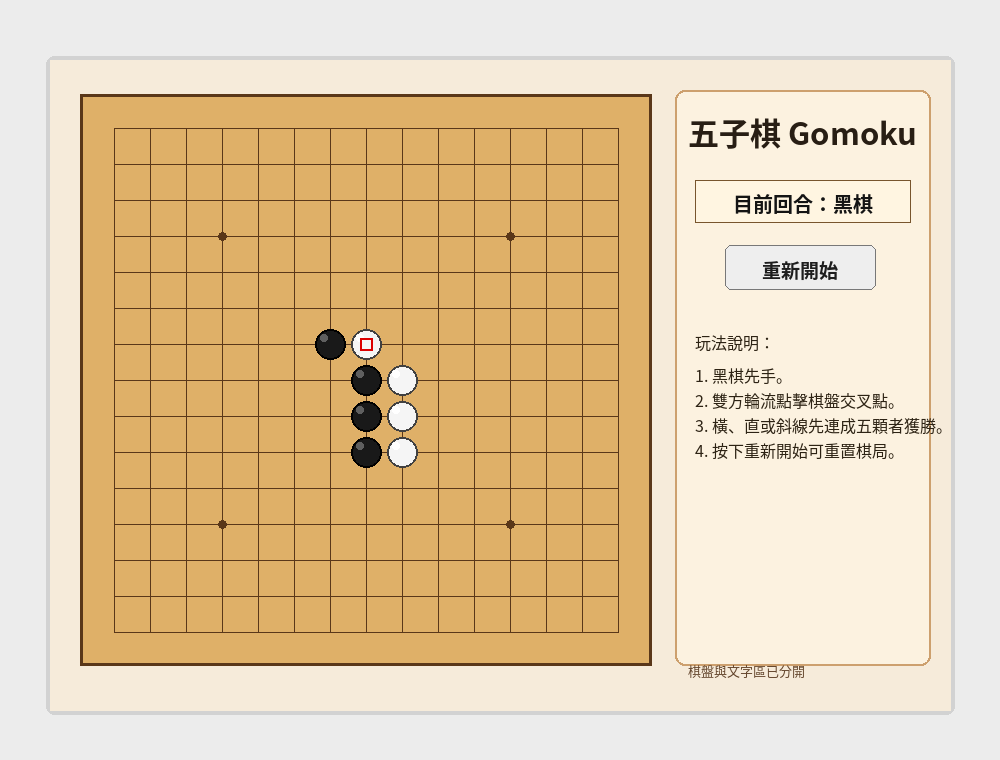
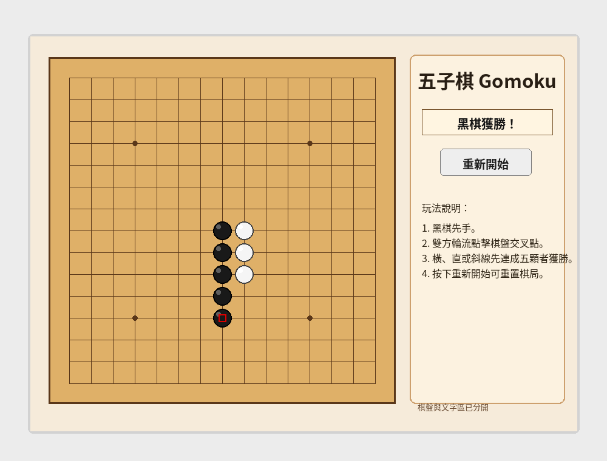

# HW2_Gomoku - 五子棋 Windows Forms 遊戲

## 一、專案簡介

本專案是「視窗程式設計 (II) 作業二：棋牌類遊戲」的五子棋遊戲，使用 **C# Windows Forms** 製作。遊戲提供 15 x 15 棋盤，讓兩位玩家以黑棋、白棋輪流下棋。程式會自動判斷橫向、直向與兩種斜線方向是否連成五顆棋子，若有玩家達成五連線，就會顯示勝利訊息並播放勝利音效。

本作業需求包含「可以讓使用者玩的棋牌類遊戲」、「顯示圖片」與「播放音效」。本專案使用 `black.png`、`white.png` 作為棋子圖片，並使用 `place.wav`、`win.wav` 作為下棋與獲勝音效。

---

## 二、功能特色

- 15 x 15 五子棋棋盤。
- 黑棋先手，黑白雙方輪流下棋。
- 使用滑鼠點擊棋盤交叉點即可放置棋子。
- 已下過的位置不能重複下棋。
- 程式會自動判斷勝負：
  - 橫向五連線。
  - 直向五連線。
  - 左上到右下斜線五連線。
  - 右上到左下斜線五連線。
- 若棋盤下滿且無人獲勝，會判定為平手。
- 右側狀態欄會顯示目前輪到黑棋或白棋。
- 勝利後會顯示 MessageBox 提示。
- 可按「重新開始」按鈕清空棋盤並重新開始。
- 使用寬版視窗配置，棋盤在左側，說明文字與按鈕在右側，避免棋盤遮住文字。
- 使用圖片素材顯示黑棋與白棋。
- 使用音效提示下棋與獲勝。

---

## 三、遊戲規則

1. 遊戲開始時由黑棋先下。
2. 玩家輪流點擊棋盤上的交叉點放置棋子。
3. 黑棋與白棋不可下在已經有棋子的地方。
4. 任一玩家只要在以下任一方向連成五顆棋子，即可獲勝：
   - 水平方向。
   - 垂直方向。
   - 左上到右下方向。
   - 右上到左下方向。
5. 獲勝後遊戲會停止，不能繼續下棋。
6. 若想重新遊玩，可以按右側的「重新開始」按鈕。

---

## 四、執行環境

建議使用以下環境執行：

- 作業系統：Windows 10 或 Windows 11
- 開發工具：Visual Studio 2022
- SDK：.NET 8 SDK
- 專案類型：C# Windows Forms App
- 需要安裝 Visual Studio 的 `.NET desktop development` 工作負載

---

## 五、執行方式

1. 解壓縮作業檔案。
2. 使用 Visual Studio 2022 開啟 `HW2_Gomoku.sln`。
3. 確認啟動專案為 `HW2_Gomoku`。
4. 按下 `F5` 或點選 Visual Studio 上方的「開始偵錯」。
5. 遊戲視窗出現後，即可開始下五子棋。

若要不使用偵錯模式執行，也可以按：

```text
Ctrl + F5
```

---

## 六、操作說明

| 操作 | 說明 |
|---|---|
| 點擊棋盤交叉點 | 在該位置放置目前玩家的棋子 |
| 重新開始 | 清空棋盤，重新由黑棋開始 |
| 勝利提示 | 有玩家連成五顆時，跳出勝利訊息 |
| 狀態欄 | 顯示目前回合或勝利結果 |

---

## 七、遊戲畫面截圖

### 遊戲進行中



### 黑棋獲勝畫面



---

## 八、專案結構

```text
HW2_Gomoku_Submission/
├── HW2_Gomoku.sln
├── HW2_Gomoku/
│   ├── HW2_Gomoku.csproj
│   ├── Program.cs
│   ├── Form1.cs
│   └── Resources/
│       ├── black.png
│       ├── white.png
│       ├── place.wav
│       └── win.wav
├── docs/
│   ├── screenshot_main.png
│   └── screenshot_win.png
├── report.docx
├── 學號_姓名.txt
├── README.md
└── .gitignore
```

---

## 九、主要程式檔案說明

### `Program.cs`

`Program.cs` 是 Windows Forms 程式的進入點，負責啟動整個應用程式並開啟 `Form1` 視窗。

### `Form1.cs`

`Form1.cs` 是本專案的主要程式檔，包含遊戲畫面、棋盤繪製、滑鼠點擊事件、勝負判斷、重新開始與音效播放等功能。

主要功能包含：

- 建立視窗 UI。
- 繪製五子棋棋盤。
- 載入黑棋、白棋圖片。
- 載入下棋音效與勝利音效。
- 處理玩家滑鼠點擊。
- 判斷該位置能不能下棋。
- 切換黑棋與白棋回合。
- 判斷是否五子連線。
- 顯示目前回合與勝利結果。

### `Resources/`

`Resources` 資料夾放置遊戲使用到的圖片與音效檔案。專案檔 `HW2_Gomoku.csproj` 已設定會把 `Resources` 內的檔案複製到輸出目錄，因此執行時可以正常載入素材。

---

## 十、勝負判斷邏輯

程式使用二維陣列紀錄棋盤狀態：

```csharp
private readonly int[,] board = new int[BoardSize, BoardSize];
```

陣列中的數值代表：

| 數值 | 意義 |
|---|---|
| `0` | 空格 |
| `1` | 黑棋 |
| `2` | 白棋 |

每次玩家下棋後，程式會從剛下的位置開始檢查四個方向：

```text
水平方向：      ← →
垂直方向：      ↑ ↓
左斜方向：      ↖ ↘
右斜方向：      ↗ ↙
```

每個方向都會同時往正方向與反方向計算連續相同棋子的數量。如果總數大於或等於 5，就代表該玩家獲勝。

---

## 十一、圖片素材來源說明

本專案使用的棋子圖片如下：

- `black.png`：黑棋圖片。
- `white.png`：白棋圖片。

這兩張圖片是本專案自製的簡易棋子圖，不是從網路下載。圖片格式為 PNG，大小為 96 x 96，程式執行時會縮放成適合棋盤的大小顯示。

若圖片載入失敗，程式也有備用處理方式，會直接用程式繪製黑色或白色圓形棋子，因此不會造成遊戲無法執行。

---

## 十二、音效來源說明

本專案使用兩個音效檔：

| 檔名 | 用途 | 說明 |
|---|---|---|
| `place.wav` | 下棋音效 | 每次成功放置棋子時播放 |
| `win.wav` | 勝利音效 | 有玩家獲勝時播放 |

這兩個音效是本專案自製的簡易提示音，不是從網路下載，也沒有使用外部音效庫。音效是利用電腦產生的短音訊，存成 WAV 檔後放入 `Resources` 資料夾中。

音效格式：

```text
WAV / PCM / 16-bit / mono / 44100 Hz
```

音效設計方式：

- `place.wav`：短促的提示聲，用來表示成功下棋。
- `win.wav`：較明亮、較長的提示聲，用來表示遊戲勝利。

程式使用 C# 內建的 `System.Media.SoundPlayer` 播放音效：

```csharp
private SoundPlayer? placeSound;
private SoundPlayer? winSound;
```

下棋成功後會播放：

```csharp
PlaySound(placeSound);
```

玩家獲勝後會播放：

```csharp
PlaySound(winSound);
```

如果電腦沒有音效裝置，或是音效檔案不存在，程式會忽略錯誤並繼續執行遊戲，不會因為音效問題導致程式中斷。

---

## 十三、GitHub 上傳注意事項

上傳 GitHub 時，請確認倉庫內包含以下內容：

- `HW2_Gomoku.sln`
- `HW2_Gomoku/` 原始程式碼資料夾
- `Resources/` 圖片與音效素材
- `docs/` 截圖資料夾
- `README.md`
- `.gitignore`

不要上傳以下編譯或暫存資料夾：

- `bin/`
- `obj/`
- `.vs/`

`.git` 資料夾是 GitHub 本機版本控制資料夾，不需要放進繳交用的壓縮檔。

---

## 十四、繳交前檢查清單

繳交前建議檢查以下項目：

- [ ] Visual Studio 可以正常開啟 `HW2_Gomoku.sln`。
- [ ] 按下 `F5` 可以正常執行遊戲。
- [ ] 棋盤可以正常顯示。
- [ ] 黑棋與白棋圖片可以正常顯示。
- [ ] 點擊棋盤可以正常下棋。
- [ ] 下棋時可以播放音效。
- [ ] 五顆連線時可以正確判斷勝利。
- [ ] 勝利時可以播放勝利音效。
- [ ] 「重新開始」按鈕可以清空棋盤。
- [ ] README.md 已更新。
- [ ] report.docx 已放入壓縮檔。
- [ ] `學號_姓名.txt` 已填入自己的 GitHub 網址。
- [ ] 壓縮檔命名為 `學號_姓名.zip`。
- [ ] 壓縮檔內沒有 `bin/`、`obj/`、`.vs/`、`.git/`。

---

## 十五、問題排除

### 1. Visual Studio 無法開啟專案

請確認電腦已安裝 Visual Studio 2022，並且有安裝 `.NET desktop development` 工作負載。

### 2. 執行時沒有聲音

可能原因：

- 電腦音量被關閉。
- Windows 音效輸出裝置未設定好。
- `Resources/place.wav` 或 `Resources/win.wav` 檔案遺失。

處理方式：

- 檢查電腦音量。
- 確認 `Resources` 資料夾內有音效檔。
- 重新建置專案後再執行。

### 3. 棋子圖片沒有顯示

可能原因：

- `Resources/black.png` 或 `Resources/white.png` 檔案遺失。
- 檔案沒有被複製到輸出目錄。

本專案已在 `.csproj` 中設定：

```xml
<Content Include="Resources\**\*">
  <CopyToOutputDirectory>PreserveNewest</CopyToOutputDirectory>
</Content>
```

正常情況下，Visual Studio 建置後會自動複製圖片與音效檔。

### 4. 棋盤或文字顯示太擠

本版本已改成寬版配置，視窗大小為 900 x 650。棋盤放在左側，狀態文字、玩法說明與重新開始按鈕放在右側，避免棋盤擋住文字。

---

## 十六、資料來源

- 遊戲玩法：一般五子棋規則。
- 棋子圖片：本專案自製簡易 PNG 圖片。
- 音效檔案：本專案自製簡易 WAV 提示音，非網路下載素材。
- 開發工具：Microsoft Visual Studio 2022、C# Windows Forms。
